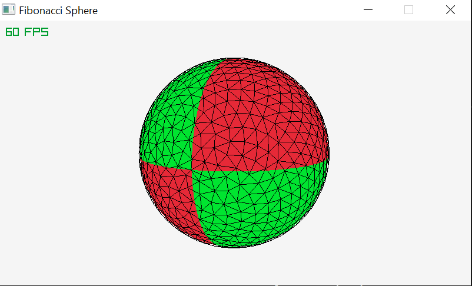

# Fibonacci Sphere Raylib

This is my implementation of generating a fibonacci sphere mesh using raylib. Heavily inspired by this blog post:

https://www.redblobgames.com/x/1842-delaunay-voronoi-sphere/

and a video by Sebastian Lague

This project generates the vertices of a fibonnaci sphere, uses orthographic projection to project those points onto a 2D plane and then uses my Delauney Triangulation code to triangulate all of the vertices before wrapping all of the points into a sphere again. To compile place the libraylib.a file inside a folder called lib and type make into your command line. I hope you enjoy. Thanks!

